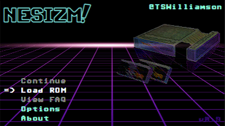
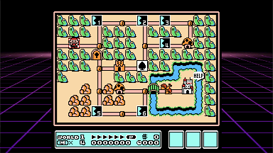

# NESizm v 0.9
NESizm is a Nintendo Entertainment System emulator for the Casio Prizm series of graphics calculators. It currently supports the FX-CG20 and FX-CG50. NESizm was built from the ground up with performance in mind, while maintaining accurate emulation and compatibility wherever possible with clever caching, forced alignment, and hand written assembly where necessary. It runs most titles at 60 FPS with no overclocking on the FX-CG50.

This project has its roots in my interest in early game development technology, as well as the inherent benefits of the Prizm as a platform. There is a large install base of players who can now play NES over 100 hours of battery life with 0 input lag from keyboard to display.

## Install

Copy the nesizm.g3a file to your Casio Prizm calculator's root path when linked via USB. NES roms (.nes) also should go inside of the root directory. The filenames for these files should be simple and less than 12 characters, such as MyGame.nes. The emulator does not support the NES 2.0 ROM format, so stick with old style roms for now.

### PAL Support

PAL is supported, but NES ROMS are notorious for not describing themselves as requiring PAL emulation. In order for NESizm to detect that a game is PAL or not, please make sure 'PAL' case sensitive is in the NES filename, such as GamePAL.nes 

## Usage

### Menu

In the menu system use the arrow keys and SHIFT or ENTER to select.

When inside a game, the MENU key will exit to the settings screen, and pressing MENU again will take you back to the calculator OS.

### In Game

You can configure your own keys in the Settings menu, these are the default I found to work well:

- Dpad : Dpad
- A: SHIFT
- B: OPTN
- Select: F5
- Start: F6
- Save State : X (multiply), which is the alpha 'S' key for save
- Load State : -> (store), which is the alpha 'L' key for load

### Save States

  
 
A single save state is supported per ROM, which can be loaded/saved using the remappable keys mentioned in the Controls section. These default to the 'S' and 'L' keys on the calculator. The save state file will be saved to your main storage with the .fcs extension.

These save states are generally intercompatible with FCEUX, the popular PC NES emulator. However, by default, FCEUX enables compression on its save states when saving, so in order to transport a save state back to your calculator, you need to disable save state compression in FCEUX.

## Support

The emulator now plays over 90% of the games I have been able to test smoothly at this point. There are scanline artifacts in  a number of them, but nothing that appears to really hamper gameplay.

Here is the current mapper support table, only including mappers I intend to implement. Eventually, the emulator will have ~97% coverage of all games released.

Mapper Name | Working | % | Name | Working | % | Name | Working | %
-|-|-|-|-|-|-|-|-
**MMC3** | Yes| 27.3%     | MMC5 | No | 0.7%             | FFE F8xxx | No | 0.6%
**MMC1** | Yes | 28.4%    | **Camerica** | Yes | 0.7%        | FFE F4xxx | No | 0.5%
**UNROM** | Yes | 13.0%   | **MMC2** | Yes | 0.2%            | 74161/32 | No | 0.5%
**NULL** | Yes | 8.9%     | Nanjing | No | 0.05%         | AVE | No | 0.5%
**AOROM** | Yes | 2.7%    | Bandai | No | 1.1%           | TC0190 / TC0350 | No | 0.4%
**CNROM** | Yes | 7.8%    | **Colour Dreams** | Yes | 1.0%   | Sunsoft 5 | No | 0.4%
Rambo-1 |No | 0.1%    | Namcot 106 | No | 1.0%       | VRC2B | No | 0.3%
**MMC6** | Yes | 0.1%     | SS8806 | No | 0.6%           | Nina-1 | No | 0.3%

A full table of ROMs and mappers can be found here, but I don't keep it entirely up to date:
https://docs.google.com/spreadsheets/d/1TfgiU6doDaGvIzSMY3flPSmZviFKiysoxi9uwl-RlRY/edit?usp=sharing

### Sound

The emulator has no current support for sound, but it is planned in the future.

## Building

My other repository, PrizmSDK, is required to build NESizm from source. Put your NESizm clone in the SDK projects directory.

To build on a Windows machine, I recommend using the project files using Visual Studio Community Edition, where I have NMAKE set up nicely. For other systems please refer to your Prizm SDK documentation on how to compile projects. Refer to the configuration options in make-DeviceRelease.bat.

If you do use Visual Studio, a project is included that uses a Windows Simulator I wrote that wraps Prizm OS functions so that the code and emulator can easily be tested and iterated on within Visual Studio. See the prizmsim.cpp/h code for details on its usage.

## Special Thanks

The Nesdev wiki, found at http://wiki.nesdev.com/ was incredibly useful in the development of NESizm. My sincerest gratitude to the community of emulator developers who collected all of the information I needed to write an emulator in a single place.

FCEUX, found at http://www.fceux.com provided great debugging tools that allowed me to compare and contrast my emulator state easily for games that had compatibility issues. Show them some love by using their emulator on PC!

<!--stackedit_data:
eyJoaXN0b3J5IjpbMzA0NDY5NzE5LC0xMjQwMDMyMDQ1LDU0ND
k3MTU1MCwyOTM5NzU5MTZdfQ==
-->